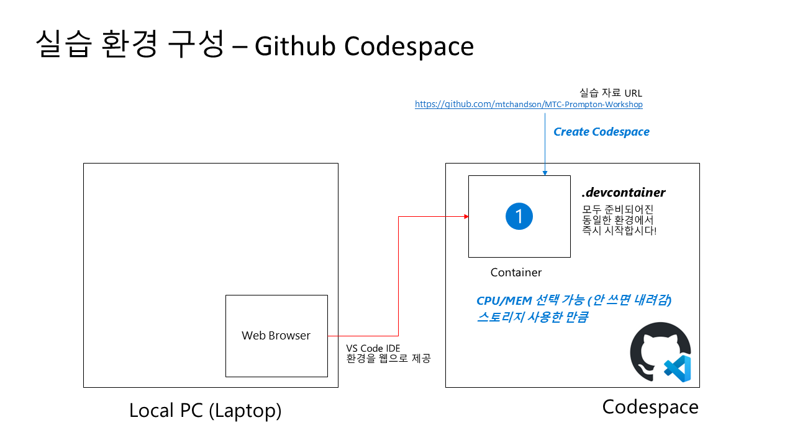
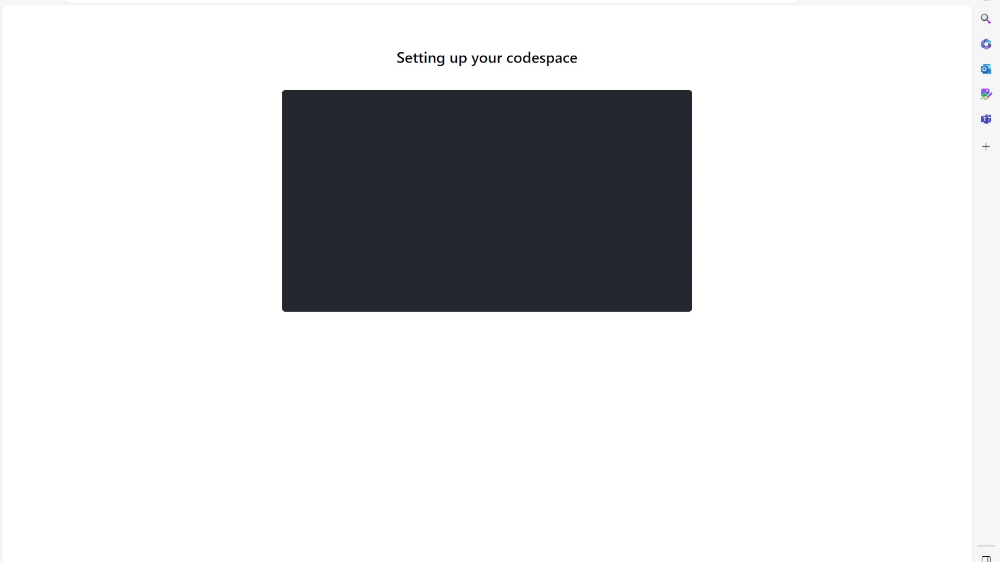
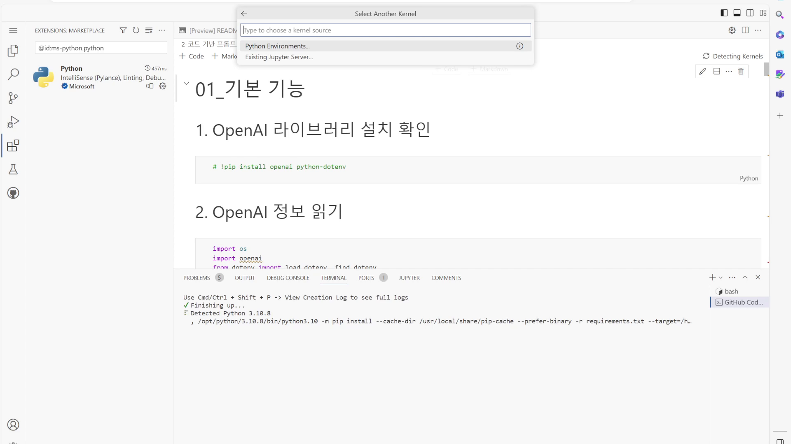
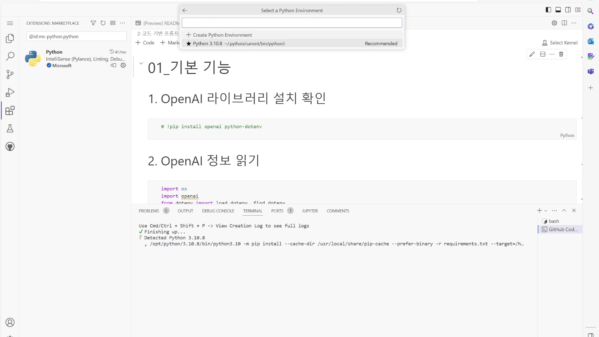
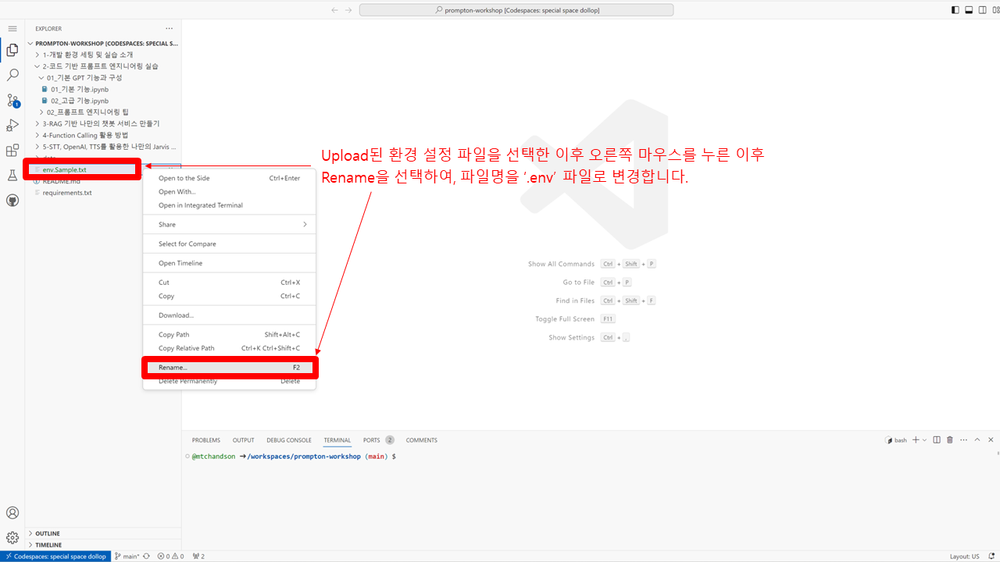

# 1 - 개발 환경 구성

#### 표준 환경 진행을 위해, Github Codespace 환경에서 Prompton Workshop이 진행됩니다. 진행을 위해서는 개인 Github 계정이 필요합니다.  

##### 개발 환경 구성은 아래의 2단계로 진행됩니다.

##### 1) Codespace 상세 환경 구성

##### 2) .env 파일 설정

#### **1) Codespace 상세 환경 구성**

1. 웹브라우저에서 [https://github.com/freedragon/prompt-workshop](https://github.com/freedragon/prompt-workshop) 로 이동 합니다.

   

2. Code > Codespaces 항목에서 'Create codespace on main'을 눌러서 Github Codespaces를 만듭니다.

   <!--  -->

   

3. Github codespace가 아래화면으로 구성이 진행됩니다.

   

   

4. 설치가 완료되면 왼쪽에 진행 자료의 항목들이 보이는 웹 VS Code환경이 나타납니다.  

   

   

5. 왼쪽 진행 자료 중에 노트북 파일을 선택하면, 오른쪽 하단에 'Python' extension 설치 문의가 나오며, 'Install' 버튼을 눌러 실행합니다.   

   

   

6. 'Python' extension이 설치되는 것을 확인합니다. 

   

   

7. 설치가 완료되면, 오른쪽 상단의 'Select Kernel'을 누릅니다.

   

   

8. 가운데 상단에 'Install/Enable suggested extention Python + Jupyter' 항목을 선택합니다.

   

   

9. 오른쪽 하단을 통해 'Python' extension과 'Jupyter' extension이 설치되는 것을 확인합니다.

   

   

10. 설치 완료 이후에 가운데 상단에 'Select Another Kernel'이 나타나고, 여기에 'Python Environments...'를 선택합니다.

    

    

11. 이전에 설치된 Recommended 항목인 'Python 3.10.x'(최신 버젼은 3.10.13입니다)을 선택합니다.

    

    

12. 오른쪽 상단에 선택한 Python Environment가 'Python 3.10.8'(최신 버젼은 3.10.13입니다)로 나타나면 정상적인 실행 환경이 준비되었습니다.

    

#### **2) .env 파일 설정

1. env.sample 파일을 오픈 합니다.

   

2. Azure Portal과 Azure OpenAI Studio 및 MS Learn사이트에서 필요한 정보들 (4가지)를 확인하고 env.sample 파일의 값을 업데이트 합니다.

   <!--  -->
   **Azure Portal에서 Base URL과 Key 확인**
   
   * 반드시 리소스가 배포 되어야 합니다.

   **Azure OpenAI Studio에서 배포 된 모델을 확인 합니다.**
   

   [Azure OpenAI Service REST API reference](https://learn.microsoft.com/en-us/azure/ai-services/openai/reference)

4. 수정된 파일 이름을 'rename' 실행을 통해 '.env' 파일로 변경합니다.

   

   

5. '.env'로 변경된 파일을 확인합니다. 

   

#### Prompt Workshop  개발 환경 세팅이 완료되었습니다. 이제 함께 실습을 시작해 볼까요?
